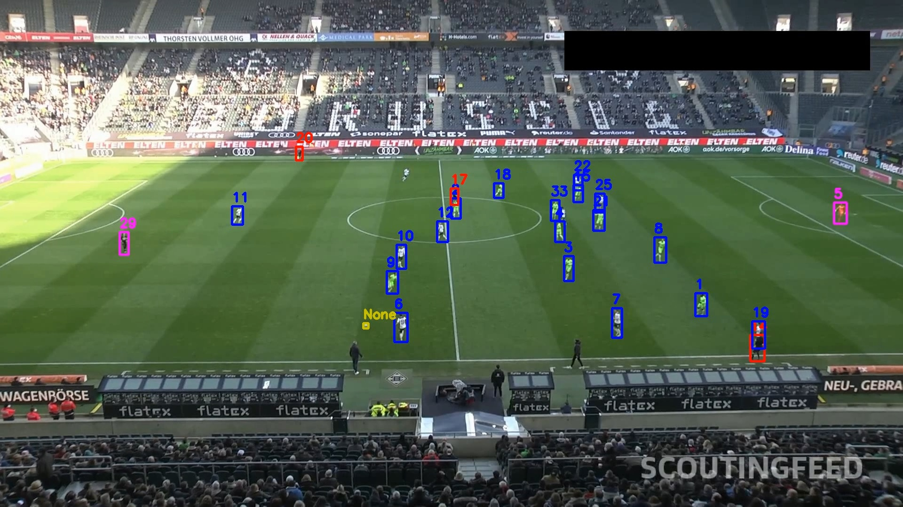
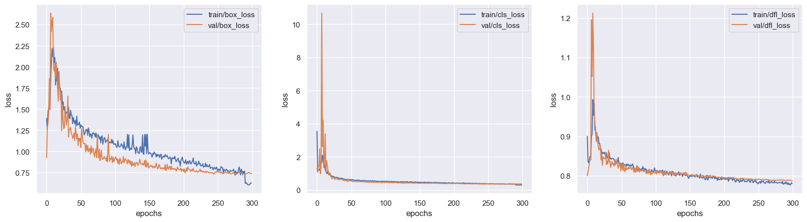

# Track football players with YOlOv8 and ByteTrack <!-- omit from toc -->

Football automated analytics is hot topics in the intersection between AI and sports. In this project, we build a tool for detecting and tracking football players, referees and ball in videos. For this we use [YOLOv8](https://github.com/ultralytics/ultralytics) (the latest version of the popular and fast object detector) for detecting the players in each frame of the video, and [ByteTrack](https://github.com/ifzhang/ByteTrack) a multi object detection model released in 2022 to identify the players and track their trajectory.

For the data, we use videos from the [DFL - Bundesliga Data Shootout](https://www.kaggle.com/competitions/dfl-bundesliga-data-shootout/data) competition on Kaggle for the demo. For training YOLOv8, we sue the [football-players-detection](https://universe.roboflow.com/roboflow-jvuqo/football-players-detection-3zvbc) dataset from Roboflow.

## Table of content <!-- omit from toc -->
- [YouTube Video Demo](#youtube-video-demo)
- [YOLOv8 training](#yolov8-training)
- [Tracking the players with ByteTrack](#tracking-the-players-with-bytetrack)
- [YOlOv8 explained](#yolov8-explained)
  - [The Backbone](#the-backbone)
  - [The Neck](#the-neck)
  - [The head](#the-head)
  - [The loss](#the-loss)
- [ByteTrack explained](#bytetrack-explained)

## YouTube Video Demo

YOLOv8l 640 + ByteTrack: [YouTube video](https://youtu.be/7bFXjk8wYs0), [YouTube video](https://youtu.be/Dusfc9dBWL8).  
YOLOv5m 1280 + ByteTrack: [YouTube video](https://youtu.be/M4_laY3VsF4)

<!--  -->

## YOLOv8 training

The first part of the project is to train YOLOv8 on detecting players in images: [Training notebook](train_yolov8_football_players.ipynb). The model was trained for 300 epochs on 204 images with a resolution of 640x640.

The model has trouble detecting the ball due to its small size. One of the solutions is to increase the network resolution to 1280x1280. However, it requires resources beyond my reach.  
The alternative was to train a YOLOv5m on 1280 resolution. Evaluation tables bellow show that has 60% better mAP50-95. However, it confuses the referees and players more often (as seen on the demo video).

<!-- YOlOv8 has been released recently and still has questionable performances compared to [YOLOv5](https://github.com/ultralytics/yolov5).  -->

<!-- 

Performance on validation set
 -->

YOLO8m 640 results

| class      | Number of images | Number of instances | Precision | Recall | mAP50 | mAP50-95 |
|------------|------------------|---------------------|-----------|--------|---------|----------|
| all        | 38               | 905                 | 0.945     | 0.755  | 0.832   | 0.585    |
| ball       | 38               | 35                  | 1         | 0.206  | 0.427   | 0.164    |
| goalkeeper | 38               | 27                  | 0.888     | 0.963  | 0.972   | 0.742    |
| player     | 38               | 754                 | 0.953     | 0.964  | 0.986   | 0.796    |
| referee    | 38               | 89                  | 0.938     | 0.888  | 0.942   | 0.637    |

YOLO8l 640 results

| class      | Number of images | Number of instances | Precision | Recall | mAP50 | mAP50-95 |
|------------|------------------|---------------------|-----------|--------|---------|----------|
| all        | 38               | 905                 | 0.975     | 0.754  | 0.859   | 0.613    |
| ball       | 38               | 35                  | 1         | 0.215  | 0.51    | 0.206    |
| goalkeeper | 38               | 27                  | 0.961     | 0.92   | 0.981   | 0.753    |
| player     | 38               | 754                 | 0.981     | 0.958  | 0.983   | 0.814    |
| referee    | 38               | 89                  | 0.956     | 0.921  | 0.963   | 0.679    |

Yolov5m 1280 results

| class      | Number of images | Number of instances | Precision | Recall | mAP50 | mAP50-95 |
|------------|----|-----|-------|-------|-------|-------|
| all        | 38 | 905 | 0.909 | 0.862 | 0.892 | 0.675 |
| ball       | 38 | 35  | 0.953 | **0.58**  | **0.653** | **0.335** |
| goalkeeper | 38 | 27  | 0.803 | 0.908 | 0.954 | 0.786 |
| player     | 38 | 754 | 0.978 | 0.983 | 0.993 | 0.864 |
| referee    | 38 | 89  | 0.902 | 0.978 | 0.969 | 0.717 |

<!-- 
 -->

<!-- 

|  | 
|:--:| 
| *YOLOv8 training losses plots* |

 -->

## Tracking the players with ByteTrack

The second part is running yolo inference on each frame of the video and then track the detections with ByteTrack: [Tracking notebook](track_players_with_bytetrack_yolov8.ipynb).  
ByteTrack works well when no others are nearby and loses the idendity of the players if they form a cluster. This is one of the challenges of object tracking.

The accuracy of the tracking depends heavily on yolo performance. Training on a large dataset would enhance the this solution.

## YOlOv8 explained 

YOlOv8 is a single-stage object detector, meaning one network is responsible for predicting the bounding boxes and classifying them. The YOLO series of algorithms are known for their low inference time.  
The network is built of three sections: the backbone, the neck and the head. In figure bellow, we see the full details of the network.

|  | 
|:--:| 
| *YOLOv8 architecture* |
| *(Source: [ open-mmlab/mmyolo](https://github.com/open-mmlab/mmyolo/tree/main/configs/yolov8))* |

### The Backbone
The backbone network extract the important features from the images at different levels. It is composed of series of ``ConvBlock`` and ``CSPLayer_2``. The CSPLayer is made of residuals blocks whose filters are concatenated to form rich features.

### The Neck
The neck is a feature pyramid network. This family of networks take as input the features of the backbone at low resolutions (the bottom-up pathway) and reconstruct them by up-scaling and applying convolution blocks between the layers. Lateral connection are added to ease the training (they function as residual connection) and compensate for the lost information due to the down-scaling and up-scaling.

|  | 
|:--:| 
| *FPN architecture* |
| *(Source: [Feature Pyramid Networks for Object Detection](https://arxiv.org/pdf/1612.03144.pdf))* |

### The head

The head network applies convolutions to the each output of the neck layers. Its output is prediction of the bounding box coordinates, width and height, the probability and the object class.

### The loss 
The loss function is as follows:

$$
\begin{gathered}
loss = \lambda_1 L_{box} + \lambda_2 L_{cls} + \lambda_3 L_{dfl} \\
\end{gathered}
$$

The $L_{cls}$ is a Cross Entropy loss applied on the class.

The $L_{box}$ is CIoU loss, it aims to:

* Increase the overlapping area of the ground truth box and the predicted box.
* Minimize their central point distance.
* Maintain the consistency of the boxes aspect ratio.

The CIoU loss function can be defined as

$$
\mathcal{L}_{C I o U}=1-I o U+\frac{\rho^2\left(b, b^{g t}\right)}{c^2}+\alpha v .
$$

where $b$ and $b^{gt}$ denote the central points of prediction and of ground truth, $\rho$ is the Euclidean distance, and $c$ is the diagonal length of the smallest enclosing box covering the two boxes. The trade-off parameter $\alpha$ is defined as

$$
\alpha=\frac{v}{(1-I o U)+v}
$$

and $v$ measures the consistency of a aspect ratio,

$$
v=\frac{4}{\pi}\left(\arctan \frac{w^{g t}}{h^{g t}}-\arctan \frac{w}{h}\right)^2 .
$$

The $L_{dfl}$ is distributional focal loss.

## ByteTrack explained

ByteTrack is a Multi Object Tracker, it identifies the detected objects and tracks their trajectory in the video. The algorithm uses tracklets, representation of tracked objects, to store the identity of detections.

The main idea of BYTE (the algorithm behind ByteTrack), is to consider both high and low confidence detections.  
For each frame the position of the bounding boxes are predicted using a Kalman filter from the previous positions. The high confidence detections $D^{high}$ are matched with these predicted tracklets by iou and are identified.  
The low confidence detection $D^{low}$ are compared with unmatched tracklets (identified objects are not associated to any bounding box in that frame). This helps identity occulted objects.  
A bin of unmatched tracklets is kept for $n$ frames to handle object rebirth. They are deleted beyond $n$ is they remain unmatched.
